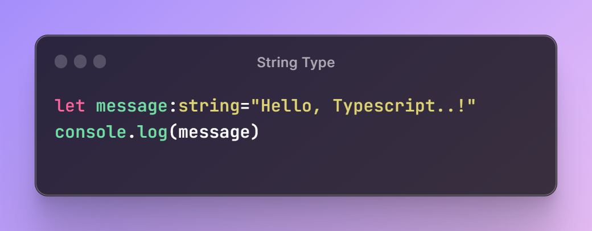

# Primitive Data Types in TypeScript 

  

## TLDR

This file discusses primitive data types in TypeScript, including number, string, and boolean, and how to define their types using type annotations. It also highlights TypeScript's error prevention compared to JavaScript.

## Key Insights

- Primitive data types in TypeScript include number, string, and boolean.
- Type annotations are used to define the type of a variable in TypeScript.
- TypeScript prevents errors by showing type mismatch errors, unlike JavaScript.

## Main Part

### Defining Primitive Data Types in TypeScript

#### Type Annotation in TypeScript

Type annotations are used to explicitly define the type of a variable in TypeScript. This helps in preventing type mismatch errors.

#### Defining Number Type

To define a variable as an integer or a floating-point number in TypeScript, the number type is used. Type annotations are used to specify the type explicitly.

  

#### Defining String Type

String type is used to define the type of a variable as a string in TypeScript. Type annotations are helpful in specifying the type explicitly.

  

#### Defining Boolean Type

Boolean type is used to define the type of a variable as true or false in TypeScript. Type annotations help in explicitly specifying the type.

  

#### TypeScript Error Prevention

TypeScript shows type mismatch errors when a variable is reassigned to a different type, preventing potential errors in the code. This feature is not present in JavaScript, which allows such type changes without showing errors.

#### Type Inferencing in TypeScript

Type inferencing is the process where TypeScript deduces or infers the type of a variable without explicitly defining it. It helps in understanding the type of variables without the need for explicit type annotations in most cases.
