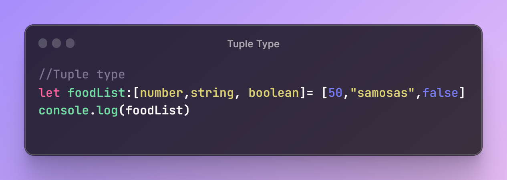
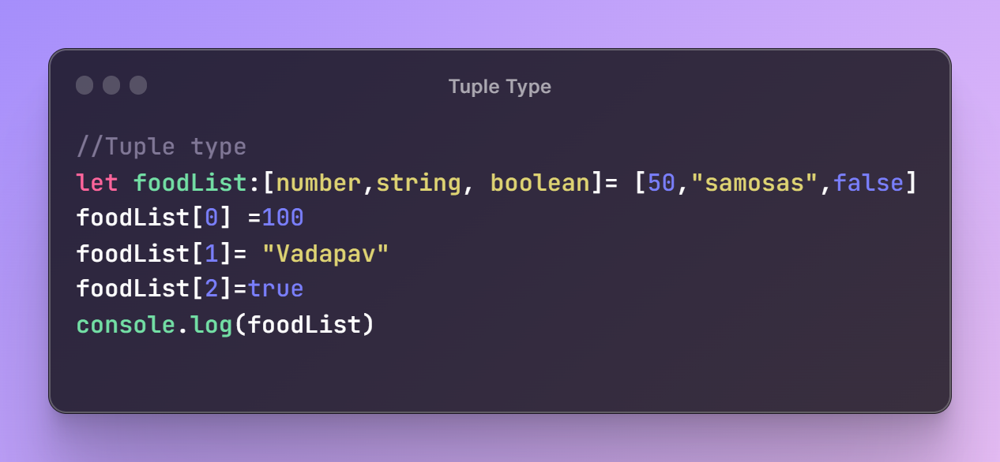
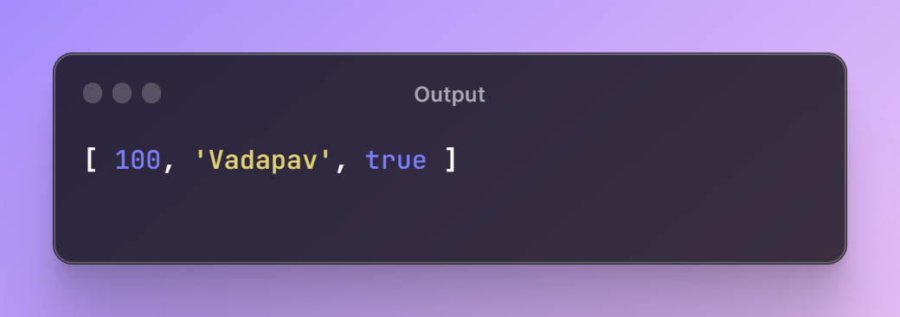

# Tuple Type in TypeScript

  

## TLDR

In this segement, the tuple types in TypeScript are discussed, explaining their features and usage. It also touches on potential errors and use cases.

## Key Insights

- A tuple is a fixed-length collection with ordered elements of specific types.
- Tuple type provides powerful features such as fixed length and ordered elements, helping to avoid potential errors.
- Tuple types are used for defining key-value pairs with predetermined types.

## Main part
## Understanding Tuple Types in TypeScript

### Definition of Tuple Type

A tuple is a sort of collection in TypeScript, similar to an array, with the special features of fixed length and ordered elements of specific types.

### Defining Tuple Type

To define a variable as a tuple type in TypeScript, the name is followed by a colon and square brackets to specify the types of the elements. Initialization is done by assigning values inside square brackets.

  

  

You can change the value of key after assigning it, but it is compulsary to chnage it in a order the way it is.

  

  

### Features of Tuple Type

Tuple types have the key features of fixed length and ordered elements, which restrict changes to the length and order of elements, helping to avoid potential errors.

### Usage of Tuple Type

Tuple types are primarily used for defining key-value pairs where the exact number and types of elements are known in advance, providing structured data.
