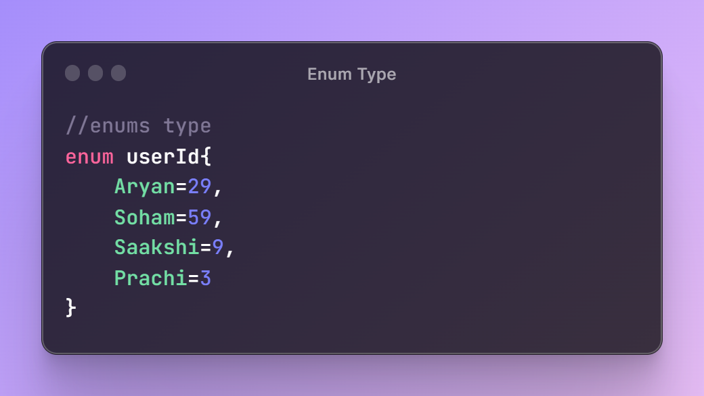
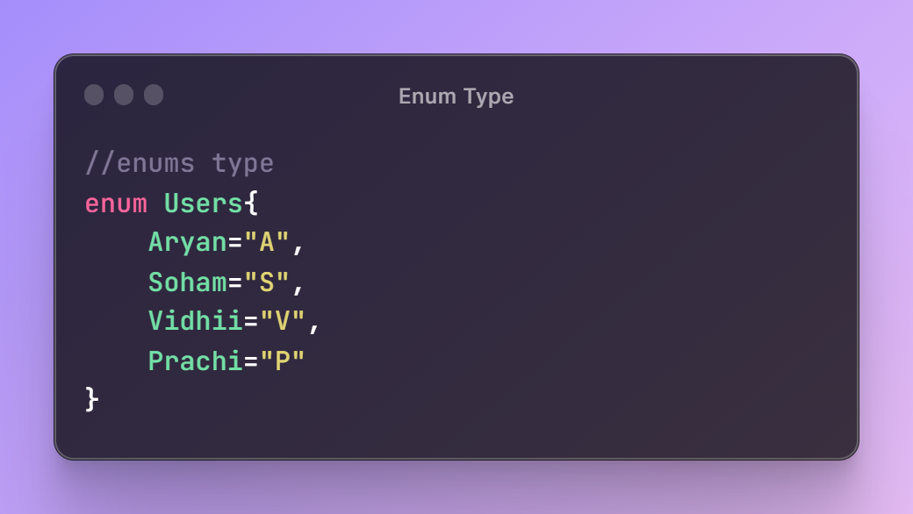
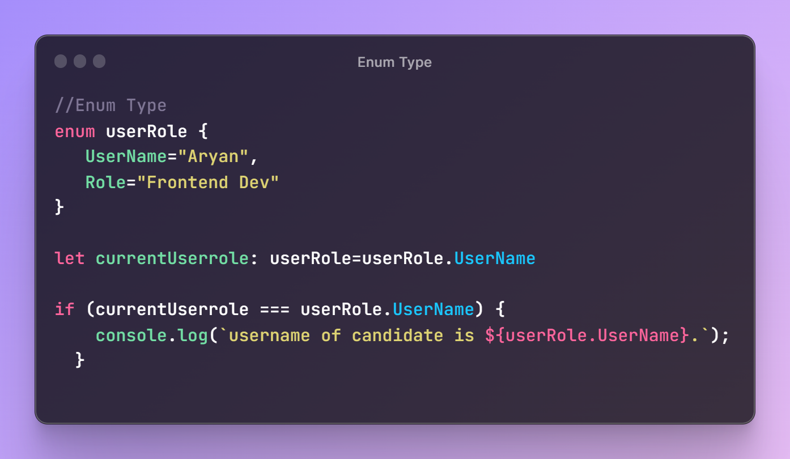

# Enum Type in TypeScript 

  

## TLDR

Enums in TypeScript are a way to define named constant values, making the code more readable and self-explanatory. They can be used for both numeric and string values, and make it easier to reference distinct values throughout the code.

## Key Insights

- Enums are a special data type in TypeScript consisting of constant values given a name.
- They are used for defining named constant values that are known not to change throughout the code.
- Enums make the code more readable and self-explanatory by grouping related constants together.

## Main Part

## Understanding Enums in TypeScript

### Definition and Usage

Enums in TypeScript are a way to define named constant values, which are used for referencing distinct values throughout the code. This makes the code more readable and self-explanatory, especially when dealing with a set of constants that won't change.

### Numeric Enums

Numeric enums in TypeScript allow assigning numeric values to enum constants. If no value is assigned, the first constant is assigned a value of 0, and subsequent ones are auto-incremented. It's also possible to assign specific numeric values to enum constants to suit specific requirements.

  

### String Enums

String enums in TypeScript are similar to numeric enums, but the assigned values are strings instead of numbers. However, unlike numeric enums, string enums cannot be left uninitialized and must have initializers for all their members.

  

## Example Like

  

  

