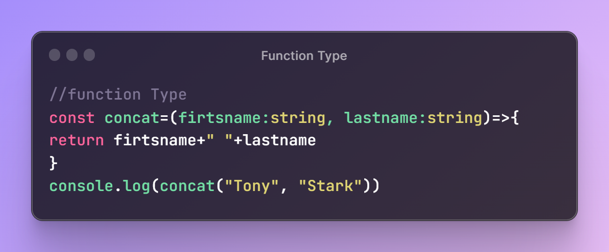
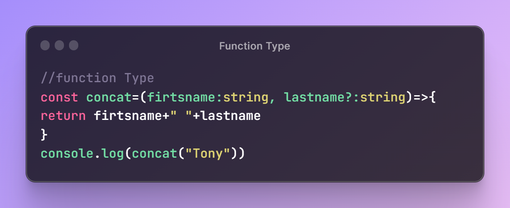
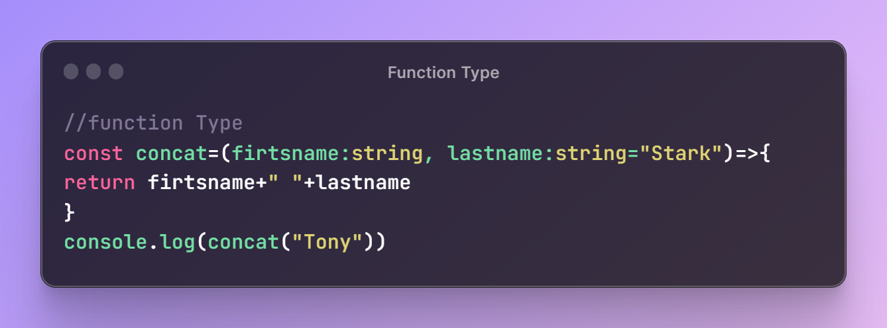

# Function Parameter Type in TypeScript 

  

## TLDR

In this segement, the function type in TypeScript is discussed, focusing on defining the parameter type, making parameters optional, and setting default values.

## Key Insights

- TypeScript requires defining the type of parameters in a function to avoid errors and ensure type safety.
- Parameters can be made optional by adding a '?' after the parameter name.
- Default values for parameters can be set using the syntax 'parameterName = defaultValue'.

## Main Part

## Function Type in TypeScript

### Defining Parameter Type

The importance of defining parameter types to ensure type safety in functions. It demonstrates how not defining parameter types can lead to errors due to TypeScript's type inferencing.

  

### Making Parameters Optional

The concept of making parameters optional is discussed, with the demonstration of adding a '?' after the parameter name to make it optional. The benefit of making parameters optional for handling scenarios where certain parameters may not be provided is highlighted.

  

### Setting Default Values for Parameters

The syntax for setting default values for parameters in TypeScript functions, using the 'parameterName = defaultValue' format. An example of defining a default value for a parameter is provided, showcasing its usefulness.

  

