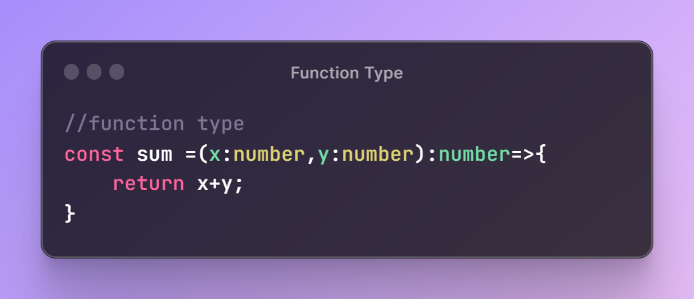
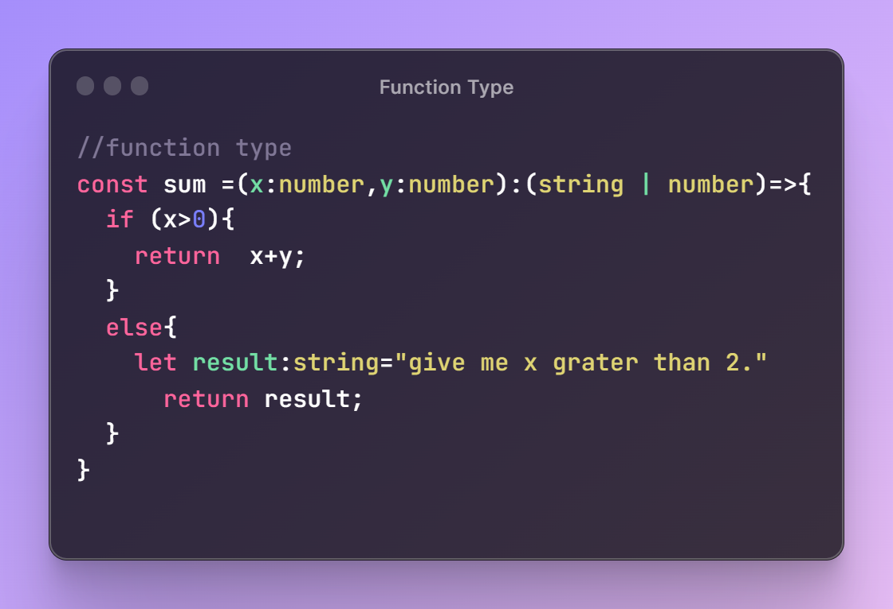
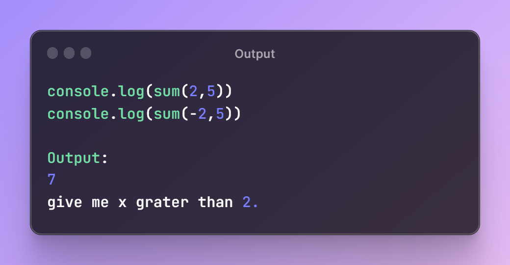
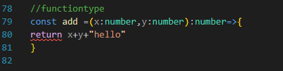

# Function Return Type in TypeScript

  

## TLDR

In this segement, we discussed the function return type in TypeScript. We learned how to define the return type of a function, including when the function does not return anything and when it returns multiple types. It also emphasized the importance of defining the return type to avoid unexpected behavior.

## Key Insights

- Defining the return type of a function is done by placing a colon after the parameter declaration and specifying the type of the value that the function should return.
- If a function does not return anything, 'void' is used as the return type.
- For functions that may return multiple types, a union of those types can be specified as the return type.
- Even if the return type is not explicitly defined, TypeScript infers the return type, but it is advisable to define it to avoid unexpected behavior and errors.

## Main Part

## Function Return Type in TypeScript

### Defining Return Type

The return type of a function can be defined by placing a colon after the parameter declaration and specifying the type of the value that the function should return. If the function does not return anything, 'void' is used as the return type.

  

### Multiple Return Types

If a function may return multiple types, a union of those types can be specified as the return type. This allows the function to return values of different types based on specific conditions.

  

  

### Type Inference and Error Handling

TypeScript can infer the return type of a function, even if it is not explicitly defined. However, not defining the return type can lead to unexpected behavior, as demonstrated when a function inadvertently returns a different type. It is advisable to define the return type to prevent such errors.

  

