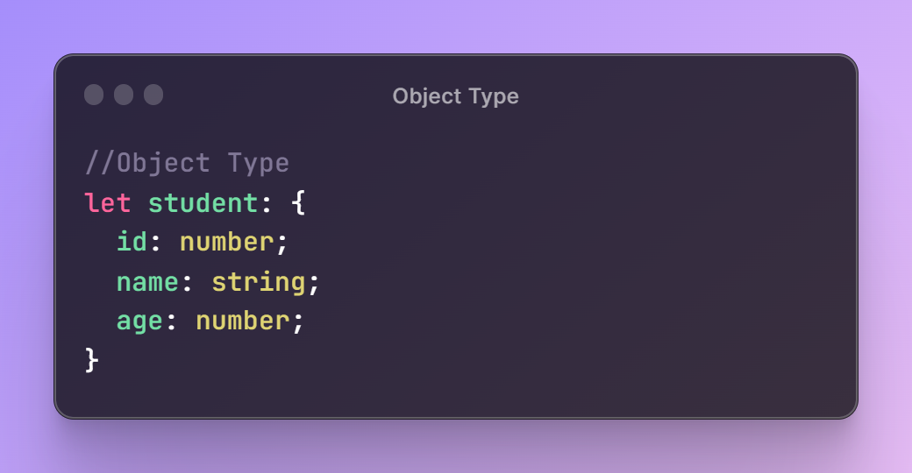
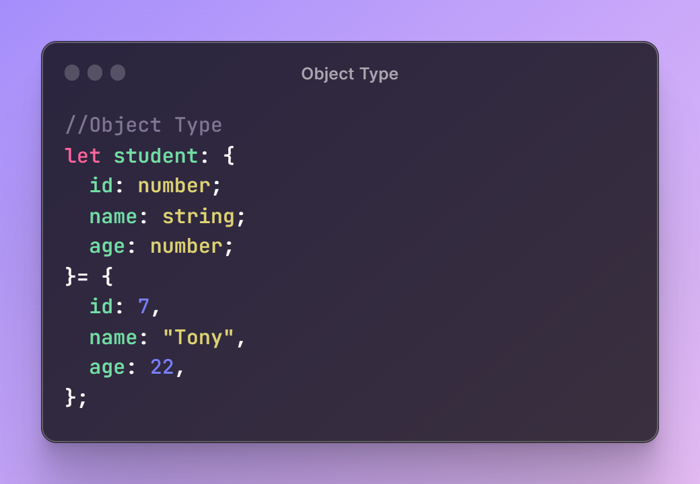
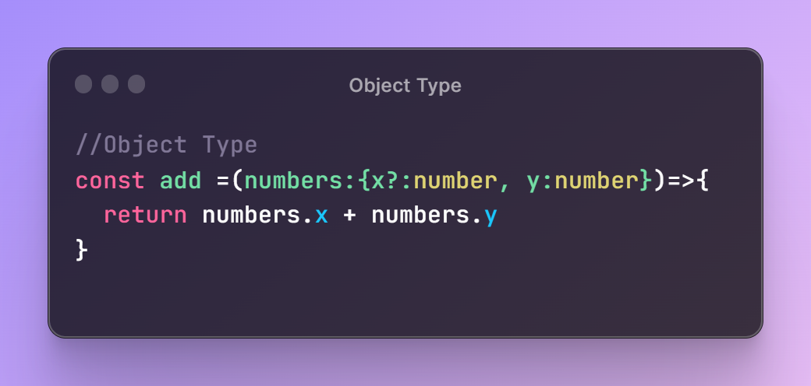
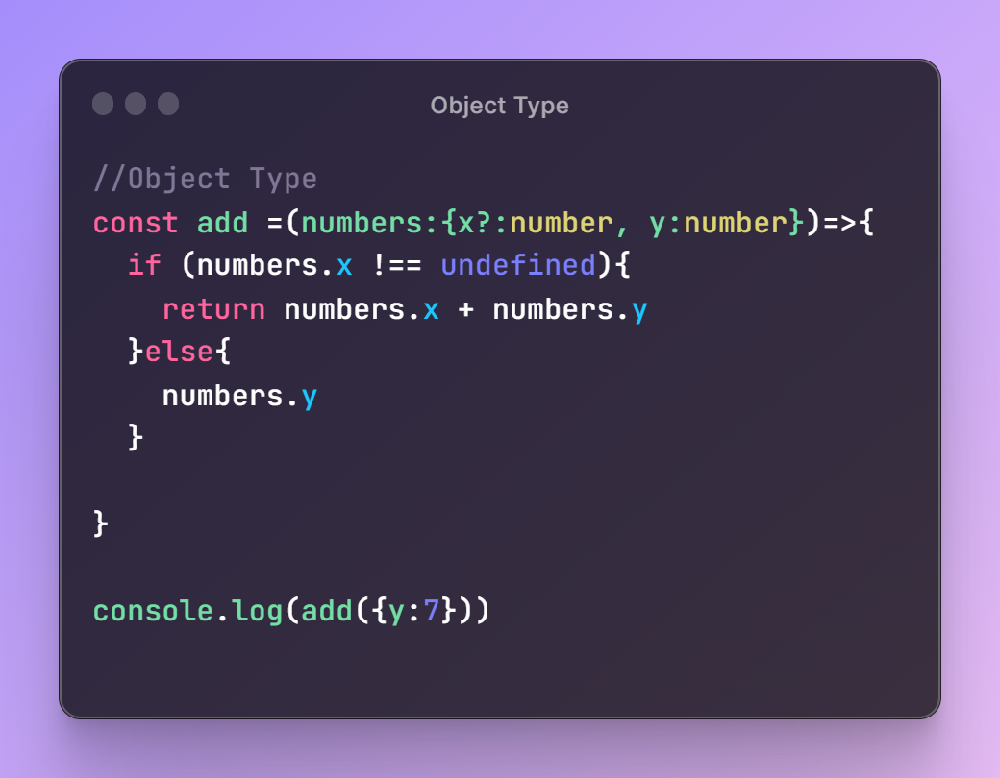

# Object Type in TypeScript

  

## TLDR

This video discusses object types in TypeScript, including defining object types, initializing objects, optional properties, and handling possibly undefined properties. It also mentions that object type is not commonly used in day-to-day code and teases upcoming topics.

## Key Insights

- Defining object types in TypeScript involves using curly braces to specify the properties and their types.
- Initializing object types with values follows the same syntax as defining.
- TypeScript allows making object properties optional by adding a question mark before the colon.
- TypeScript helps to avoid accessing possibly undefined properties by providing type safety.
- In TypeScript projects, type aliases and interfaces are preferred over the object type.

## Main part

## Object Types in TypeScript

### Defining Object Types

Object types in TypeScript are defined using curly braces to specify the properties and their types. The syntax is similar to defining object literals in JavaScript.

  

### Initializing Objects

Initializing object types with values follows the same syntax as defining. Values are assigned to the properties using curly braces after the equal sign.

  

### Optional Properties

TypeScript allows making object properties optional by adding a question mark before the colon. This provides flexibility in working with objects.

  

### Handling Possibly Undefined Properties

TypeScript helps to avoid accessing possibly undefined properties by providing type safety. If a property may be undefined, conditional checks can be used to handle it.

  

