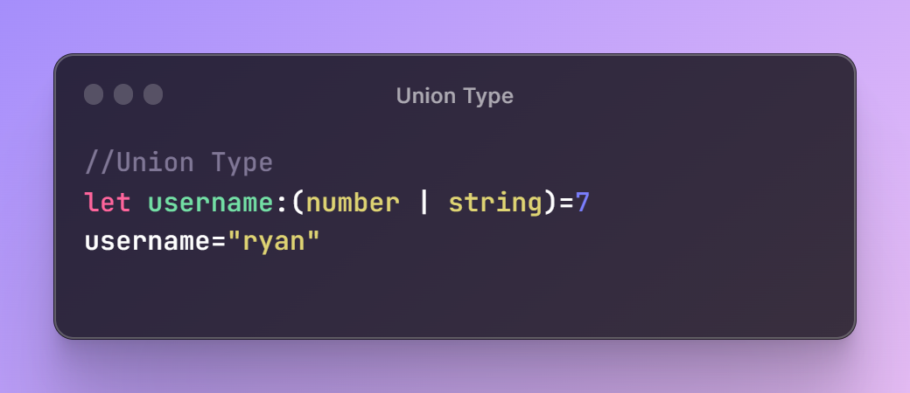
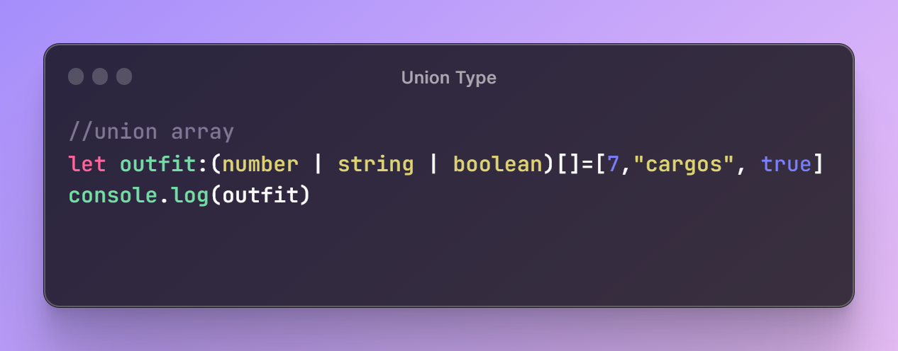

# Union Type in TypeScript 

  

## TLDR

The video discusses the union type in TypeScript, which allows for the creation of new types from existing ones. It demonstrates how to use the union type for variables with multiple data types and in defining arrays with multiple value types.

## Key Insights

- Union type in TypeScript allows the creation of new types from existing ones.
- It is useful for variables with multiple data types and defining arrays with multiple value types.

## Main Part

## Understanding Union Type in TypeScript

### Definition of Union Type

This segment explains that the union type in TypeScript allows the formation of a new type from existing ones. It demonstrates how a union type can be used for variables with different data types.

### Example with Variable Declaration

An example of a student ID variable is used to demonstrate the use of union type. It shows how the union type is defined and initialized, and the possibility of reassigning different data types to the variable.

  

### Example with Array Declaration

Another example is provided for defining an array with multiple value types using the union type. It elaborates on how the union type can be used to create a heterogeneous array.

  

