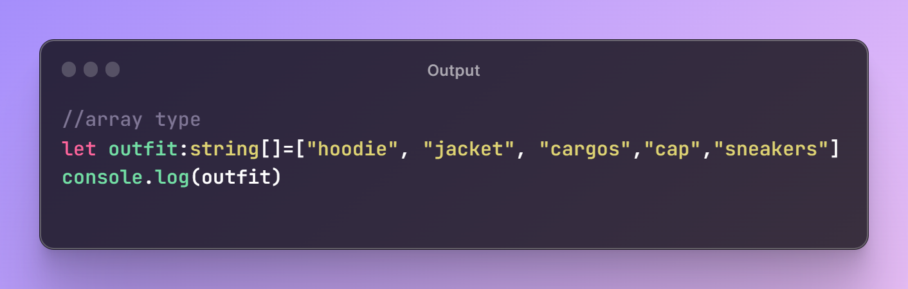
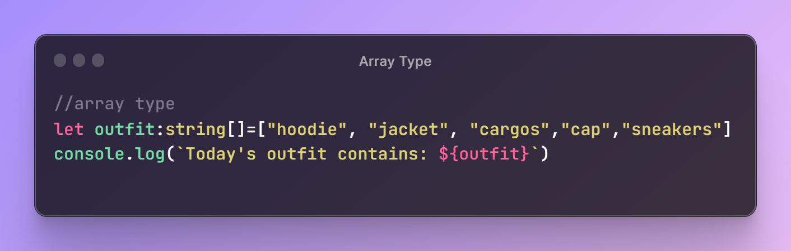

# Array Type in TypeScript 

  

## TLDR

In this segment of the TypeScript series, the discussion focuses on the array type in TypeScript, including how to define arrays of specific types, the concept of type inferencing for arrays, and the possibility of defining arrays with multiple types.

## Key Insights

- Arrays in TypeScript can be defined for specific data types, such as arrays of strings or arrays of numbers.
- Type inferencing in TypeScript allows the type of an array to be automatically inferred, but it is recommended to define the type in advance.
- Arrays in TypeScript can also have multiple types inside them, known as heterogeneous arrays.

## Main Part

## Array Type in TypeScript

### Defining Specific Type Arrays

Arrays in TypeScript can be defined for specific data types by specifying the type of values inside the array. For example, an array of strings or an array of numbers can be defined using the appropriate syntax.

  

Output:

  

  

Output:

  

### Type Inferencing for Arrays

Type inferencing in TypeScript allows the type of an array to be automatically inferred by the values it contains. However, it is considered good practice to explicitly define the type of an array in advance.

